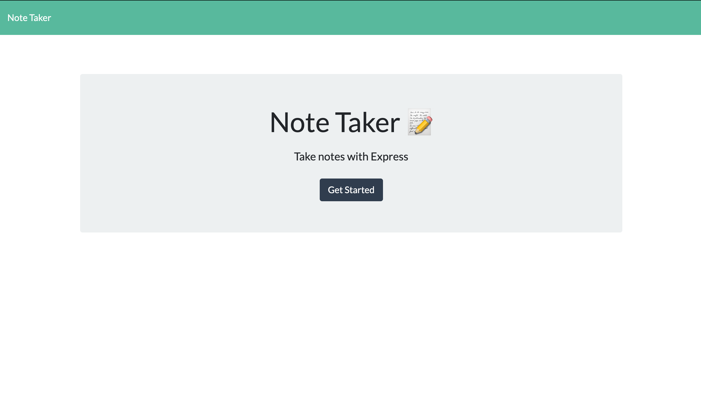
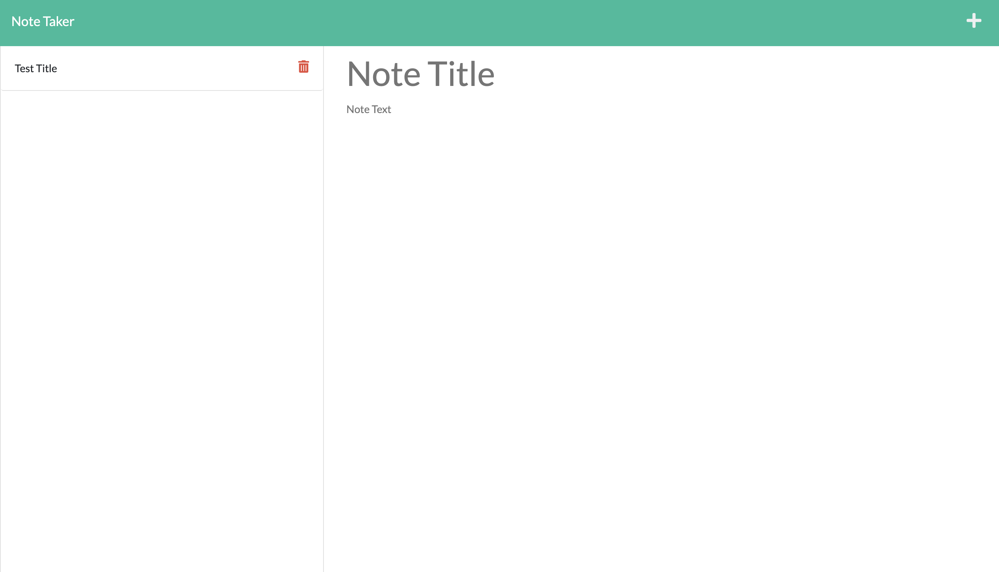

# Express.js Note Taker
Bootcamp Challenge 11

## Your Task

My task was to create an Note Taker application that uses an Express.js backend. Upon opening this application, click the Get Started Button. This will take the user to a new view, that will allow the them to take notes. To create a new note, click the + button in the upper right hand corner where the user can add a note title and content. Once, a title and text input have been provided a save button icon will appear in the upper right hand corner that wil1 enable to user to save a note. Lastly, to delete a note, just click the garbage bin icon.

Hope you enjoy this application!

## Preview

Here is a preview of the deployed application.

## Links

https://github.com/ndifiori/Express.js-Note-Taker

https://quiet-brook-99275.herokuapp.com/

